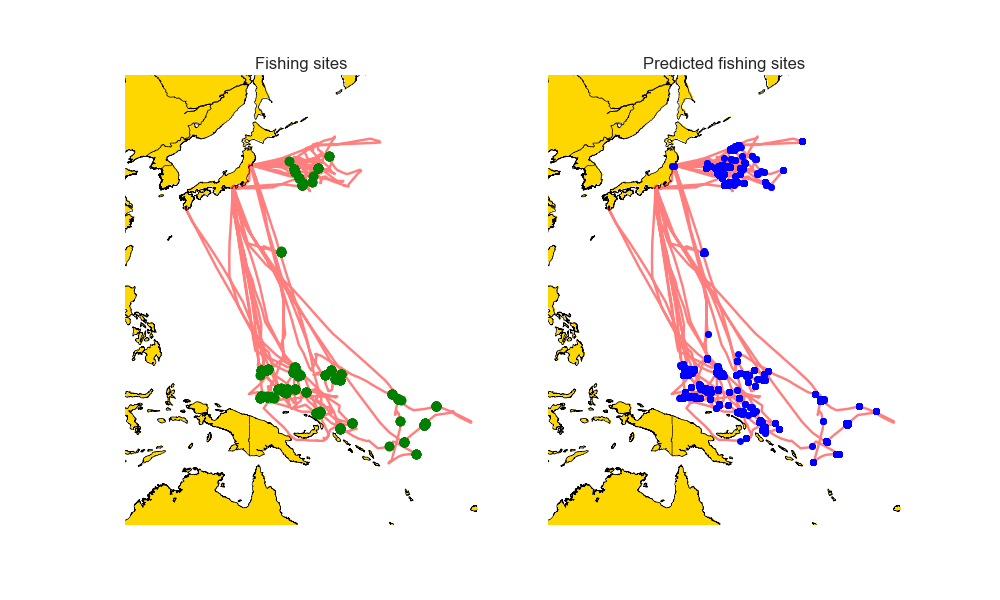
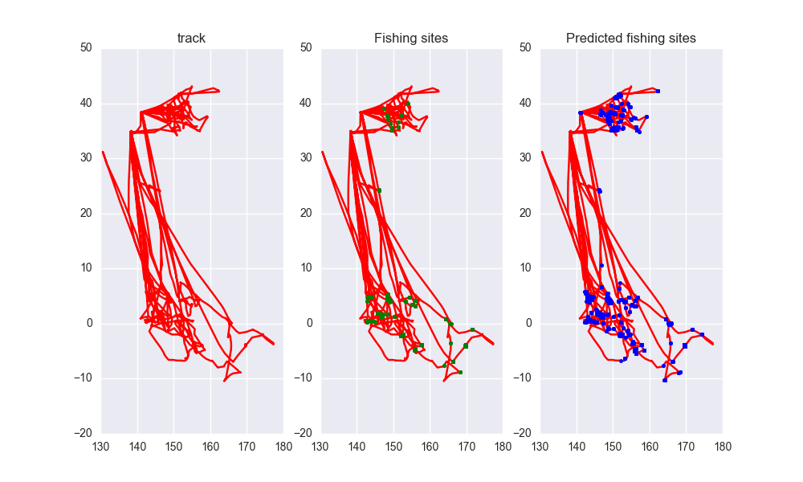
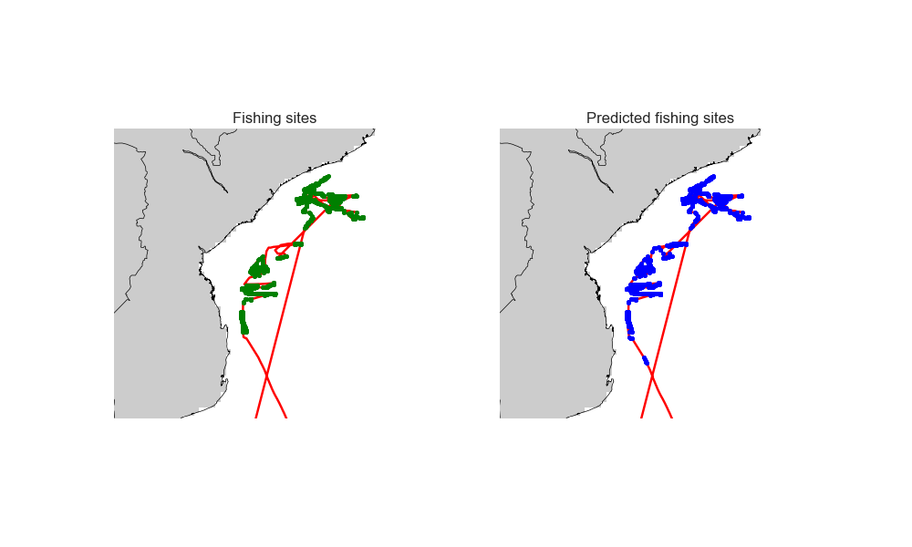
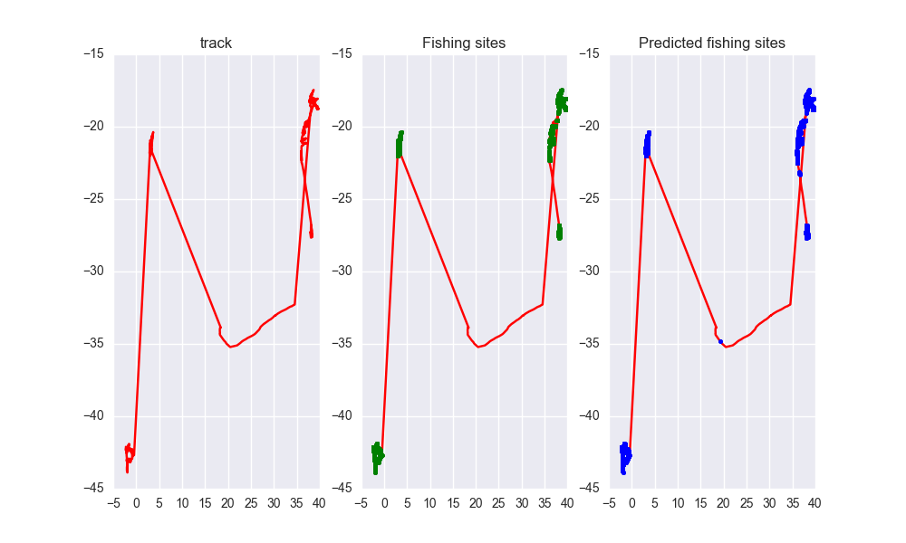

# Detecting Fishing Activity Using Machine Learning

## Project Overview

This project focuses on detecting and monitoring overfishing activities across the world's oceans using machine learning techniques. By leveraging data from the Global Fishing Watch (GFW) and employing various algorithms, we aim to identify fishing vessels and predict fishing sites to assist in the sustainable management of marine resources.

## Table of Contents

- [Introduction](#introduction)
- [Data Collection](#data-collection)
- [Literature Survey](#literature-survey)
- [Proposed Work](#proposed-work)
- [Performance Analysis](#performance-analysis)
- [Results](#results)
- [Conclusion](#conclusion)
- [References](#references)

## Introduction

Overfishing and illegal fishing are significant issues affecting marine ecosystems and local economies. By constructing a vessel monitoring system, we aim to detect fishing vessels and predict potential fishing sites to mitigate overfishing practices.

## Data Collection

We utilize data from the Automatic Identification System (AIS), which provides information on vessel identity, type, position, course, speed, and other safety-related information. This data is collected by satellites and terrestrial receivers, producing millions of data points daily.

## Literature Survey

Our research builds upon various studies that discuss the impacts of overfishing and propose methods for monitoring and managing fishing activities. Key references include:

1. **Discourse in fisheries: constructing vessel monitoring systems and overfishing**
2. **Does Unreported catch lead to overfishing?**
3. **Ecosystem Overfishing in the Ocean**
4. **Evidence of Overfishing in Small-Scale Fisheries in Madagascar**

## Proposed Work

We process the AIS data by dividing it into windows based on vessel type and time intervals. We then apply machine learning algorithms, such as Random Forest (RF) and Gradient Boosting (GB), to train models that predict fishing activities. The best-performing models are used to identify fishing vessels and potential fishing sites.

## Performance Analysis

The following parameters were found to be most effective for different vessel types:

- **Longliners**: 
  - Features: course_norm_sin_cos, window_1800, window_3600, etc.
  - Best Parameters: `{'max_features': 7, 'min_samples_split': 15, 'n_estimators': 50}`
  - Accuracy: 0.9826 (train), 0.899 (cross)

- **Trawlers**: 
  - Features: course_norm_sin_cos, window_1800, window_3600, etc.
  - Best Parameters: `{'max_features': 5, 'min_samples_split': 15, 'n_estimators': 50}`
  - Accuracy: 0.9628 (train), 0.9224 (cross)

- **Purse Seines**: 
  - Features: course_norm_sin_cos, window_1800, window_3600, etc.
  - Best Parameters: `{'learning_rate': 0.2, 'max_depth': 5, 'min_samples_leaf': 20}`
  - Accuracy: 0.9978 (train), 0.8594 (cross)

## Results

Our model successfully identified fishing vessels and predicted potential fishing sites in various regions, such as Micronesia, Eastern Asia, South of Africa, and Madagascar. The results are communicated to relevant authorities using a simple mail transfer protocol.

*Figure 1: Purse Seines Model 3 GBC*

*Figure 2: Purse Seines LAT-LON*

*Figure 3: Longliners Model 6 RF*

*Figure 4: Longliners LAT-LAN*

## Conclusion

Overfishing is a critical global issue with severe consequences for marine ecosystems and human communities. Our project provides a robust solution for monitoring and predicting fishing activities, aiding in the fight against overfishing and promoting sustainable fishing practices.

## References

1. Bailey, P. D., & Yearley, S. Discourse in fisheries: constructing vessel monitoring systems and overfishing.
2. Rudd, M. B., & Branch, T. A. Does Unreported catch lead to overfishing?
3. Coll, M., Libralato, S., Tudela, S., Palomera, I., & Pranovi, F. Ecosystem Overfishing in the Ocean.
4. Gough, C. L. A., Dewar, K. M., Godley, B. J., Zafindranosy, C., & Broderick, A. C. Evidence of Overfishing in Small-Scale Fisheries in Madagascar.
5. Snapir, B., Waine, T. W., & Biermann, L. Maritime Vessel Classification to Monitor Fisheries with SAR.
6. Hutton, T., Mardle, S., Pascoe, S., & Clark, R. A. Modelling fishing location choice within mixed fisheries.
7. Tello, M., Ribeiro e Silva, S., & Guedes Soares, C. Seakeeping performance of fishing vessels in irregular waves.
8. Sadovy de Mitcheson, Y. J., Linardich, C., Barreiros, J. P., Ralph, G. M., Aguilar-Perera, A., Afonso, P., Erisman, B. E., Pollard, D. A., Fennessy, S. T., & Bertoncini, A. A. Valuable but vulnerable: Over-fishing and under-management continue to threaten groupers so what now?
9. Brierley, A. S., & Kingsford, M. J. Impacts of Climate Change on Marine Organisms and Ecosystems.
10. Green, A. L., Fernandes, L., Almany, G., Abesamis, R., McLeod, E., Aliño, P. M., White, A. T., Salm, R., Tanzer, J., & Pressey, R. L. Designing Marine Reserves for Fisheries Management, Biodiversity Conservation, and Climate Change Adaptation.
11. Evans, D. The consequences of illegal, unreported and unregulated fishing for fishery data and management.
12. Link, J. S., Brodziak, K. T., Ewards, S. F., Overholtz, W. J., & Mountain, D. Marine ecosystem assessment in a fisheries management context.
13. Halpern, S., Walbridge, S., Selkoe, K. A., Kappel, C. V., Micheli, F., & others. A global map of human impacts on marine ecosystems.
